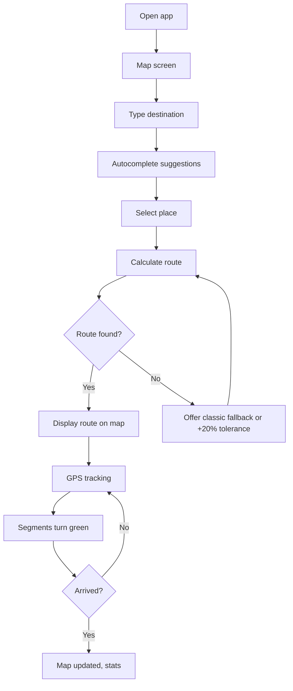
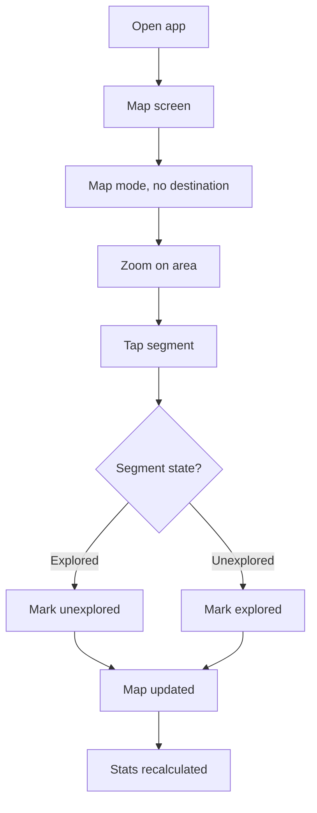
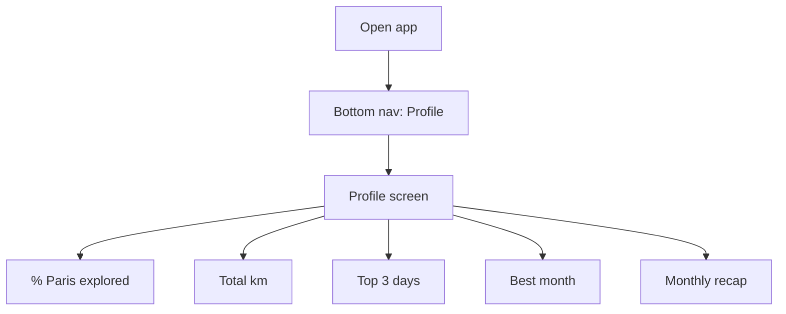
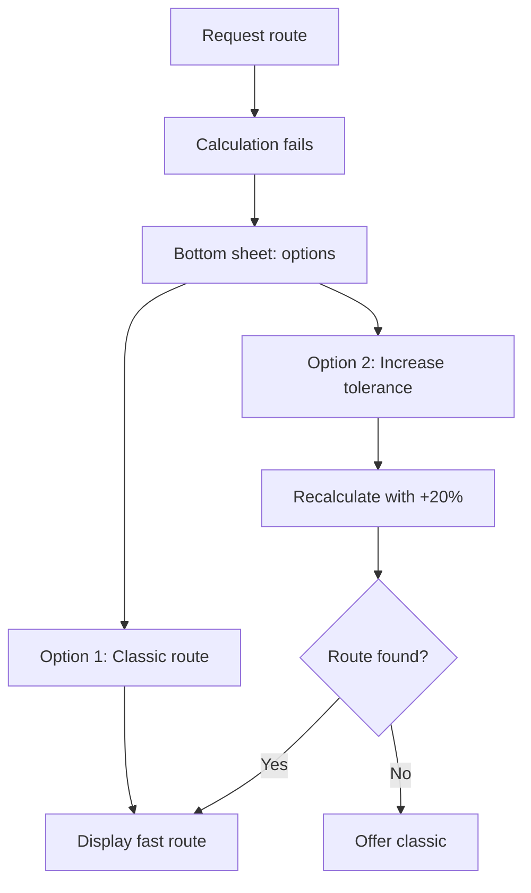

# UX Design Specification parcours-paris

**Author:** Rominche
**Date:** 2026-02-13

---

## Executive Summary

### Project Vision

parcours-paris transforms daily Paris commutes into discovery opportunities. Unlike Maps or Citymapper that optimize for speed, the app proposes A→B routes that favor unexplored streets with a controlled time surplus (~15%). Users see their progress on a colored map and can enrich their exploration via information bubbles on points of interest.

### Target Users

**Primary user:** Rominche (creator) — Personal app, no market target. A curious Parisian who wants to discover Paris systematically (streets, Invaders hunting), walks on foot, and accepts slightly longer routes to explore new streets.

### Key Design Challenges

- **Map as primary interface:** Balance information density (colored segments, bubbles) with readability, especially while walking
- **Outdoor mobile flow:** Usage on foot, outdoors, with constraints (sunlight, one-handed use, divided attention)
- **Precise manual marking:** Selecting segments on a touch map without cluttering the interface
- **Motivating progression:** Making stats (%, km, records) engaging without over-gamifying

### Design Opportunities

- **Map as identity:** The colored map can become the app's distinctive visual signature
- **Discreet enrichment:** On-demand bubbles keep the map clean while offering contextual content
- **Simplicity:** Personal use allows prioritizing clarity and efficiency over marketing features

---

## Core User Experience

### Defining Experience

The core experience is: enter a destination → get a discovery-oriented route → follow it → see the map update. The primary loop is navigation A→B with preference for unexplored streets. Secondary flows: viewing the progress map, manual segment marking, and checking profile stats.

### Platform Strategy

Android native (Kotlin), touch-first. Outdoor usage (sunlight, one-handed, divided attention). Offline-first: map and navigation without connection. OSM data preloaded locally.

### Effortless Interactions

- Quick destination input (autocomplete, favorites)
- Immediate route display on the map
- Clear visual feedback (colored segments, progress)
- Simple manual marking (select, mark/unmark)
- Stats accessible in a few taps

### Critical Success Moments

1. **First route:** User sees a path that avoids already-explored streets
2. **Map update:** New segments turn "explored" in real time
3. **Profile:** Percentage of Paris explored increases visibly
4. **Manual marking:** Quick correction without friction

### Experience Principles

- **Map first:** The map is the primary interface, not a secondary screen
- **Few taps:** Main actions reachable in 1–2 interactions
- **Outdoor readable:** Contrast, sizing, legibility in sunlight
- **One-handed:** Key touch targets within thumb reach
- **Immediate feedback:** Every action has a quick visual response

---

## Desired Emotional Response

### Primary Emotional Goals

**Primary:** Curiosity satisfied — users feel curious and rewarded when discovering new streets.

**Secondary:** Progress (seeing the percentage grow), Control (mastery over exploration via tolerance setting, manual marking), Lightness (no pressure, personal use, relaxed).

### Emotional Journey Mapping

| Phase | Desired Feeling |
|-------|-----------------|
| Discovery | Interest, willingness to try |
| Entering destination | Confidence, anticipation |
| Route proposed | Satisfaction ("this is different from Maps") |
| While walking | Curiosity, attention to surroundings |
| After journey | Accomplishment, visible progress |
| Profile / stats | Motivation, pride |
| Error / edge case | No frustration, clear fallback |

### Micro-Emotions

- **Confidence** over doubt about route relevance
- **Accomplishment** over frustration (stats, manual correction)
- **Satisfaction** over overwhelm (discreet bubbles, readable map)

### Design Implications

- **Curiosity satisfied** → On-demand enrichment bubbles, no clutter
- **Progress** → Immediate visual feedback (map, stats), monthly recap
- **Control** → Visible tolerance parameter, simple manual marking
- **Lightness** → Clean interface, no forced gamification

### Emotional Design Principles

- **Reward discovery:** Every new street counts visually
- **Avoid frustration:** Classic route fallback, easy manual correction
- **Stay discreet:** Optional enrichment, no intrusive notifications
- **Celebrate progress:** Stats that motivate without overwhelming

---

## UX Pattern Analysis & Inspiration

### Inspiring Products Analysis

| App | UX Strengths | Transferable |
|-----|--------------|--------------|
| Google Maps | Fluid destination input, autocomplete, readable map | Search bar, route visual feedback |
| Citymapper | Mode choice, clear ETA, simple interface | Time display, visual hierarchy |
| Strava | Progress stats, recaps, light gamification | Profile, stats, monthly recap |
| Komoot | Discovery-oriented routes, offline maps | Discovery philosophy, offline mode |
| Organic Maps | Clean OSM map, lightweight, offline-first | OSM map, readability, no clutter |

### Transferable UX Patterns

**Navigation:** Search bar at top with autocomplete → quick destination input; Full-screen map with discreet controls → map-first focus.

**Interaction:** Tap on segment to select → manual marking; Visible tolerance parameter (slider/toggle) → user control.

**Visual:** Simple color coding (e.g. green = explored, gray = unexplored) → readability; LOD by zoom level → clarity at different scales.

**Progress:** Concise stats (%, km, top days) → motivation; Monthly recap → sense of progress.

### Anti-Patterns to Avoid

- **Map clutter:** Too many POIs, permanent bubbles → keep map readable
- **Heavy onboarding:** Multiple tutorials → personal use, keep it minimal
- **Over-gamification:** Badges, mandatory streaks → stay restrained
- **Complex navigation:** Deep tab hierarchies → 2–3 main screens
- **Speed-only optimization:** Like Maps/Citymapper → preserve discovery logic

### Design Inspiration Strategy

**Adopt:** Search bar + autocomplete (Maps) for destination input; Clean OSM map (Organic Maps) for readability; Stats and recap (Strava) for progress.

**Adapt:** Discovery-oriented routing (Komoot) → applied to urban streets; Explored/unexplored color coding → unique to parcours-paris.

**Avoid:** Map clutter (Maps POIs); Heavy gamification (Strava); Speed-only optimization (Maps, Citymapper).

---

## Design System Foundation

### Design System Choice

**Material Design 3 (Material You)** with Jetpack Compose.

### Rationale for Selection

- Native Android integration, proven components, accessibility built-in
- Fast development for solo developer
- Outdoor readability (contrast, sizing)
- Jetpack Compose alignment with modern Kotlin stack
- No existing brand guidelines — Material provides solid defaults

### Implementation Approach

- **UI:** Jetpack Compose + Material 3
- **Map:** MapLibre (or equivalent) with custom styling for colored segments
- **Customization:** Material 3 palette for parcours-paris (explored/unexplored colors)

### Customization Strategy

- **Semantic colors:** Green = explored, gray = unexplored (integrated into Material palette)
- **Standard components:** Buttons, text fields, FAB, bottom sheet
- **Custom components:** Map overlay, segment selection, enrichment bubbles

---

## Defining Core Experience

### Defining Experience

"Enter a destination and get a route that favors unexplored streets." This is the action users would describe to friends: "The app suggests a different path than Maps, with streets I haven't walked yet."

### User Mental Model

- **Reference:** Maps/Citymapper (destination → route → follow)
- **Difference:** Route optimizes for discovery, not speed
- **Expectation:** Enter destination, get route, follow on map
- **Confusion risk:** Understanding why the route is longer; role of tolerance parameter

### Success Criteria

1. **Speed:** Route displayed in < 5 seconds
2. **Clarity:** Explored vs unexplored segments visible immediately
3. **Control:** Tolerance adjustable if no satisfying discovery route
4. **Feedback:** Map updates in real time during the journey

### Novel UX Patterns

- **Familiar:** Search bar, full-screen map, GPS tracking, route display
- **Novel:** Discovery-oriented routing, explored/unexplored color coding
- **Approach:** Reuse Maps patterns for navigation; introduce color as progress indicator

### Experience Mechanics

| Phase | Action | Feedback |
|-------|--------|----------|
| Initiation | Tap search bar | Input field active |
| Input | Type + autocomplete | Place suggestions |
| Validation | Tap suggestion | Route calculation |
| Display | Route on map | Colored segments, ETA, tolerance |
| Following | Walk, GPS active | Real-time position, segments turn "explored" |
| Completion | Arrive at destination | Map updated, stats updated |

---

## Visual Design Foundation

### Color System

**Base:** Material Design 3 (Material You) — dynamic palette from system theme.

**Semantic colors (map):**
- **Explored:** Green (Material primary or tertiary) — positive progress
- **Unexplored:** Neutral gray — to discover
- **Active route:** Blue or accent — current journey

**Accessibility:** Contrast ≥ 4.5:1 for text, ≥ 3:1 for UI elements (WCAG AA). Test light and dark modes for outdoor use.

### Typography System

**Base:** Roboto (Material 3 default) — proven mobile readability.

**Hierarchy:** Titles (Roboto Bold, titleLarge/Medium); Body (Roboto Regular, bodyLarge); Labels (bodyMedium, labelLarge).

**Outdoor readability:** Minimum 14sp body, 16sp input fields. Avoid very thin weights in sunlight.

### Spacing & Layout Foundation

**Base:** Material 3 grid (4dp) — spacing in multiples of 4 (8, 12, 16, 24).

**Layout:** Map full-screen with overlay controls (16dp padding); Bottom sheet adaptive height, 16dp radius; Search bar top, 16dp margin, light elevation.

**Density:** Airy layout for outdoor readability.

### Accessibility Considerations

- **Contrast:** WCAG AA for text and icons
- **Touch targets:** Minimum 48dp for tappable areas
- **Dark mode:** Supported for night use
- **Reduced motion:** Respect system preferences

---

## Design Direction Decision

### Design Directions Explored

8 mockup variations: Map-First Minimal, Bottom Sheet Primary, FAB Search, Compact Top Bar, Bottom Navigation, Card Overlay, Dark Map Focus, Light Airy. HTML showcase: `ux-design-directions.html`.

### Chosen Direction

**Map-First Minimal + Bottom Navigation + Light Airy**

- Full-screen map with top search bar
- Bottom nav: Map | Profile | Settings
- Light theme: green = explored, gray = unexplored

### Design Rationale

Aligns with map-first principle, outdoor readability, and simplicity. Bottom nav is familiar Android pattern. Clean, uncluttered interface.

### Implementation Approach

- Map screen: full-screen MapLibre, search bar overlay (16dp padding)
- Bottom nav: 3 destinations (Map, Profile, Settings)
- Bottom sheet for route details when navigating
- Color palette: Material green (explored), neutral gray (unexplored)

---

## User Journey Flows

### Journey 1 — Navigation A→B

**Goal:** Get a discovery-oriented route and follow it to destination.

### Journey 2 — Manual Marking

**Goal:** Mark/unmark segments to correct progress.

### Journey 3 — Progress Tracking

**Goal:** View Paris discovery statistics.

### Journey 4 — Edge Case: No Route

**Goal:** Handle failure to find satisfying discovery route.

### Journey Patterns

- **Navigation:** Bottom nav for Map | Profile | Settings
- **Decision:** Bottom sheet for choices (route, tolerance)
- **Feedback:** Immediate map and stats update

### Flow Optimization Principles

- **Few steps:** Destination → Route in 2 taps
- **Clear feedback:** Segment colors, ETA, progress
- **Error handling:** Explicit fallback, no dead ends
- **Progressive disclosure:** Enrichment bubbles on demand

---

## Component Strategy

### Design System Components

Material 3 components: TextField/OutlinedTextField (destination input), Button, FAB, IconButton, BottomSheet, BottomNavigationBar, Card, Scaffold, TopAppBar.

### Custom Components

| Component | Purpose | Key Specs |
|-----------|---------|-----------|
| MapSegmentLayer | Colored segments on map | MapLibre layer, green/gray, LOD by zoom |
| SegmentSelector | Segment selection for manual marking | Tap to select, highlight, mark/unmark actions |
| EnrichmentBubble | POI info bubble on map | Icon on map, tap → bottom sheet/dialog |
| RouteSummaryCard | Route summary (ETA, tolerance) | Card in bottom sheet |
| ProfileStatCard | Single stat display (%, km, top days) | Label + value |
| ToleranceSlider | Time tolerance adjustment | Slider 10–25%, clear label |

### Component Implementation Strategy

- Use Material 3 tokens (colors, typography, spacing)
- Custom components as Compose composables
- Map: MapLibre with custom segment styling
- Accessibility: labels, 48dp touch targets, focus order

### Implementation Roadmap

**Phase 1 (Core):** MapSegmentLayer, SearchBar, Route BottomSheet — MVP navigation
**Phase 2 (Support):** SegmentSelector, RouteSummaryCard, ToleranceSlider — manual marking
**Phase 3 (Profile):** ProfileStatCard, Bottom nav — Profile screen
**Phase 4 (Enrichment):** EnrichmentBubble — info bubbles

---

## UX Consistency Patterns

### Button Hierarchy

| Level | Use | Example |
|-------|-----|---------|
| Primary | Main action | "Start" route, "Mark explored" |
| Secondary | Alternative | "Classic route", "Cancel" |
| Tertiary | Secondary | Links, settings |

**Rule:** One primary button per screen or bottom sheet.

### Feedback Patterns

| Type | Use | Behavior |
|------|-----|----------|
| Loading | Route calculation | Spinner on map or search bar |
| Success | Segment marked | Segment turns green immediately |
| Error | Route not found | Bottom sheet with options |
| Info | Enrichment bubble | Tap → bottom sheet with content |

**Rule:** Visual feedback within 1 second.

### Form Patterns

- **Destination search:** OutlinedTextField with icon, autocomplete, no strict validation
- **Tolerance:** Slider with label (e.g. "+15% time")
- **Validation:** No blocking validation; fallback if no result

### Navigation Patterns

- **Bottom nav:** Map | Profile | Settings — always visible on main screens
- **Back:** System back or close button for bottom sheet
- **Deep link:** Not planned for MVP

### Additional Patterns

- **Bottom sheet:** Route choice, route details, enrichment content
- **Empty state:** Profile at 0% — simple "Start exploring" message
- **Loading state:** Map visible, light overlay during route calculation

---

## Responsive Design & Accessibility

### Responsive Strategy

**Platform:** Android only (phones, optionally tablets).

**Mobile (primary):** Full-screen map, search bar overlay, bottom nav always visible, 48dp touch targets.

**Tablet (optional):** Same layout scaled up; larger map and bottom sheet. No multi-column layout for MVP.

### Breakpoint Strategy

| Device | Width | Approach |
|--------|-------|----------|
| Phone small | 320–360dp | Compact layout, 12dp padding |
| Phone standard | 360–411dp | Standard layout, 16dp padding |
| Phone large | 411dp+ | Same layout, more space |
| Tablet | 600dp+ | Scaled layout, wider bottom sheet |

**Reference:** 360dp baseline.

### Accessibility Strategy

**Target:** WCAG 2.1 Level AA.

- **Contrast:** ≥ 4.5:1 text, ≥ 3:1 UI elements
- **Touch targets:** ≥ 48dp
- **TalkBack:** Labels for map, segments, buttons
- **Focus:** Logical order, visible indicators
- **Dark mode:** Supported for night use
- **Reduced motion:** Respect system preferences

### Testing Strategy

- **Devices:** Test on small, standard, large screens
- **TalkBack:** Verify labels and flow
- **Contrast:** Automated tools (e.g. Android Lint)
- **Performance:** Map rendering fluency

### Implementation Guidelines

- **Compose:** `Modifier.semantics` for labels
- **Touch targets:** `Modifier.minimumInteractiveComponentSize(48.dp)`
- **Theme:** Light/dark via Material 3
- **Map:** Text alternative for segments (e.g. "Street X: explored")

---

